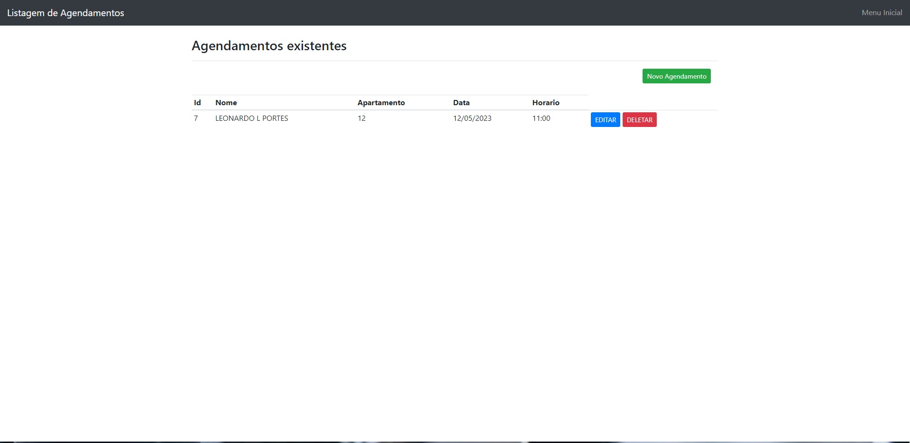
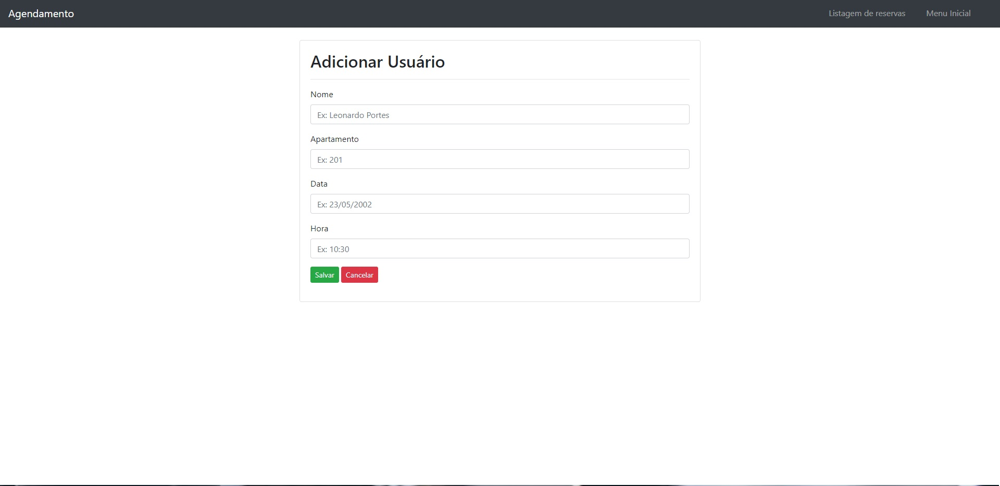
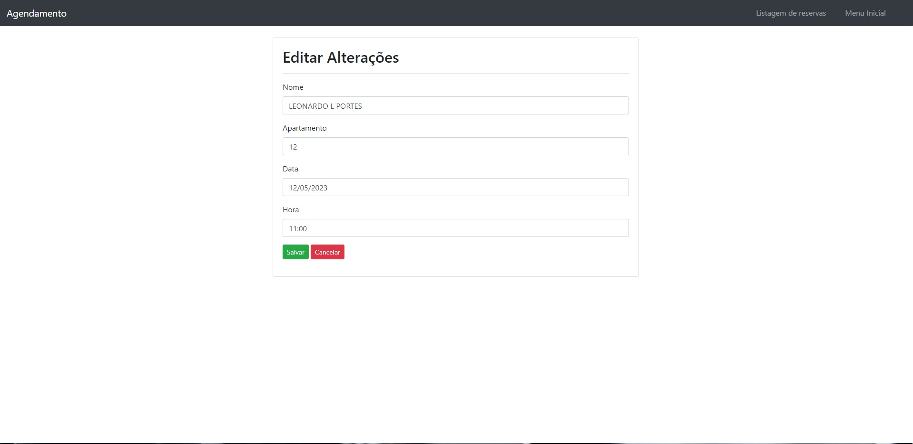

<h1> SA06 - Parte 1 </h1>

  Projeto de gerenciamento de reservas de academias residenciais. Max Company ©.

## Sumário
<ul>
  <li><a href="#telas">Telas</a></li>
  <li><a href="#tecnologias">Tecnologias utilizadas</a></li>
  <li><a href="#getting-started">Getting Started</a></li>
  <li><a href="#licença">Licença</a></li>
</ul>
 

## Telas
<table>
<tr>
  <th>Tela Inicial</th>
  <th>Listagem de reservas</th>
  <th>Adição de Reservas</th>
  <th>Edição de Reserva</th>
  </tr>
  <tr>
    <td></td>
    <td></td>
    <td></td>
    <td></td>
  </tr>
</table>
 

## Tecnologias

- Java
- WildFly 24
- HTML
- CSS
- Bootstrap
- MySQL
 

## Getting Started

- Eclipse [Required]
- Gerenciador de banco SQL (MySQL WorkBench / PostGres / Adjacente) [Required]
- Java 8 [Required]
- JDK 1.8+ [Required]
- WildFly 24 [Required]
 

1. Clonar o repositório
<pre>
<code>git clone https://github.com/SetropLeo/Gym_Schedule.git</code>
</pre>
 

2. Configurar o projeto com o banco de dados no arquivo usuarioDAO (src/main/java/dao/AgendamentoDAO.java)
<pre>
<code>1. Alterar login do banco</code>
<code>2. Alterar senha do banco</code>
<code>3. Alterar url do banco</code>
</pre>
 

3. No gerenciador de bancos, criar um novo banco chamado gymschedule. Rodar o seguinte comando: 
<pre>
<code>create database gymschedule</code>
</pre>
 

4. Criar a seguinte tabela dentro do banco gymschedule: 
<pre>
<code>create table `agendamentos` (
 id INT NOT NULL AUTO_INCREMENT PRIMARY KEY,
 nome VARCHAR(50) NOT NULL,
 apartamento nome VARCHAR(50) NOT NULL,
 data nome VARCHAR(50) NOT NULL,
 horario nome VARCHAR(50) NOT NULL
);</code>
</pre>
 

5. Para rodar o projeto, clicar com o botão direito em cima da pasta do projeto e selecionar: 
<pre>
 <code>Run As -> Run on Server -> WildFly 24</code>
</pre>

 Após isso, é só acessar o seguinte link:

<code><a href="http://localhost:8080/GymSchedule/">http://localhost:8080/GymSchedule/</a></code>
  

## Licença

- Licença MIT
  
